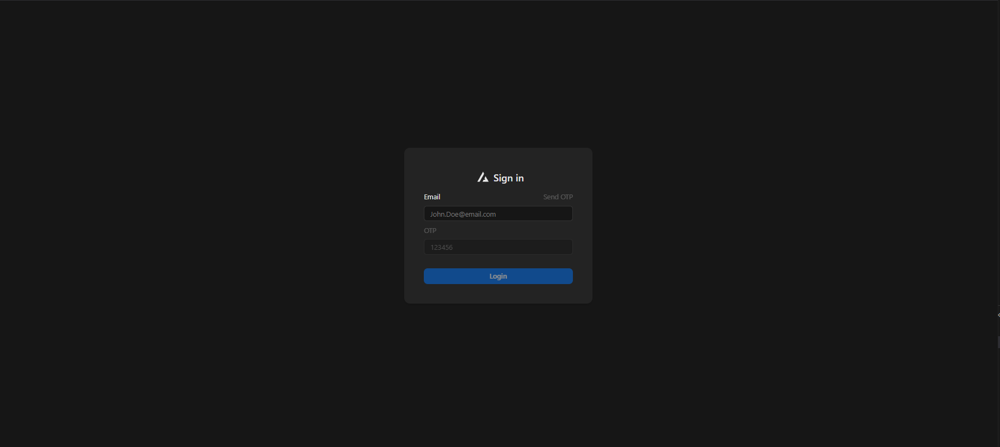
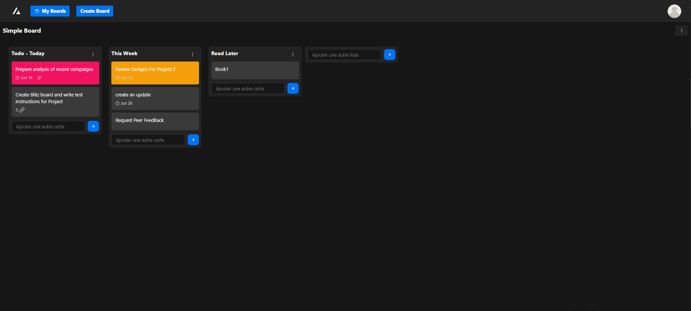
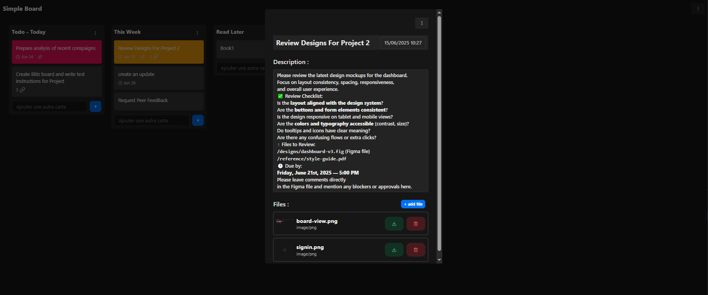
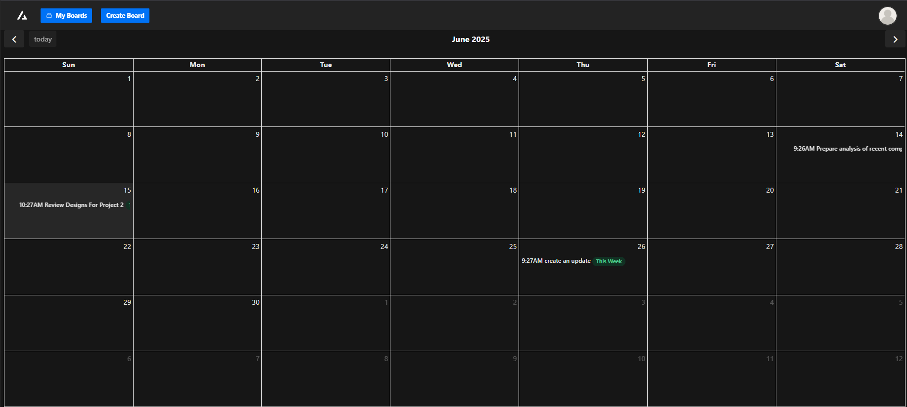

# 🗂️ Planifio — A Trello-Inspired Task Management App

Planifio is a kanban-style task manager where users can create boards, lists, and cards — and manage tasks with drag-and-drop, descriptions, file uploads, and due dates. Cards with due dates are automatically displayed on a calendar.

<svg fill="none" height="42" viewBox="0 0 32 32" width="42" xmlns="http://www.w3.org/2000/svg"><rect height="100%" rx="16" width="100%"></rect><path clip-rule="evenodd" d="M17.6482 10.1305L15.8785 7.02583L7.02979 22.5499H10.5278L17.6482 10.1305ZM19.8798 14.0457L18.11 17.1983L19.394 19.4511H16.8453L15.1056 22.5499H24.7272L19.8798 14.0457Z" fill="currentColor" fill-rule="evenodd"></path>
</svg>
<h2 style="margin:0; padding:0;  ">Planifio</h2>

---

## ✨ Features

- ✅ User authentication using **OTP (One-Time Password)**
- ✅ Create and manage multiple **boards**
- ✅ Add **lists** inside boards (e.g., To Do, In Progress, Done)
- ✅ Add and **reorganize cards** within and between lists
- ✅ Card features:
  - 📝 Description
  - 📎 File attachments
  - 📅 Due date picker
- ✅ Cards with due dates are displayed in a **calendar view**
- 🔁 **Drag and drop** support for lists and cards

---

## 🖼️ Screenshots
### 👤 Sign In
Signin using only your email.

---

### 📋 Board View
View and manage all your boards and lists.

---

### 📝 Card Details
Add a description, upload files, and set a due date.

---

### 📅 Calendar View
All cards with due dates are shown in a calendar.

 
---

## 🔐 Authentication

Users log in securely using **OTP-only authentication** — no passwords required.
- OTP is sent via email or phone (customizable backend logic).
- Upon successful OTP verification, users receive a **JWT Access Token and Refresh Token**.

---

## 🧰 Tech Stack

### 🖥️ Frontend
- **React.js**
- **Zustand** for global state management
- **React Beautiful DnD** for drag-and-drop
- **FullCalendar.io** for calendar integration

### 🛠️ Backend
- **ASP.NET Core**
- **JWT** for authentication
- **Custom OTP service** (email or phone-based)

### 🗄️ Database
- **MySQL / MariaDB**

---

## 🚀 Getting Started

### 🔧 Prerequisites
- Node.js + npm
- .NET 6+ SDK
- MySQL/MariaDB running

## 🙏 Acknowledgments

- This project was inspired by the intuitive design and functionality of [Trello](https://trello.com).
- Drag-and-drop functionality is powered by the excellent [`react-beautiful-dnd`](https://github.com/atlassian/react-beautiful-dnd) library by Atlassian.
- Calendar integration is made possible thanks to the robust and flexible [FullCalendar](https://fullcalendar.io).